## VPC Infrastructure Deployment Artifacts.

This document contains visual artifacts that demonstrate the successful execution and configuration of the Terraform-based AWS VPC setup.

### 1️⃣ VPC
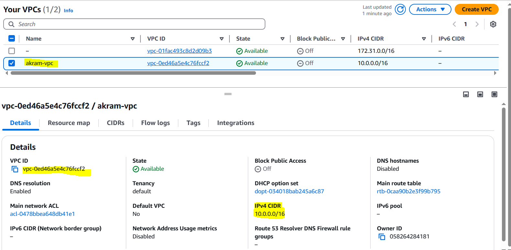

### 2️⃣ Internet Gateway
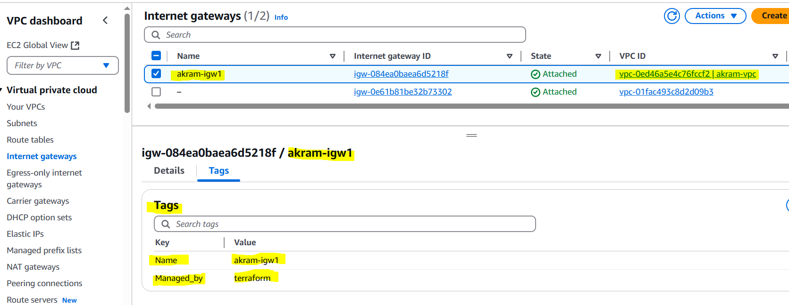

### 3️⃣ Public_Subnet

### 4️⃣ Private_Subnet
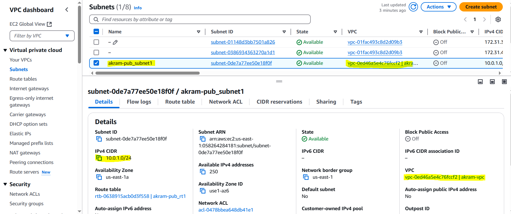

### 5️⃣ Public_Route_Table

### 6️⃣ Private_Route_Table
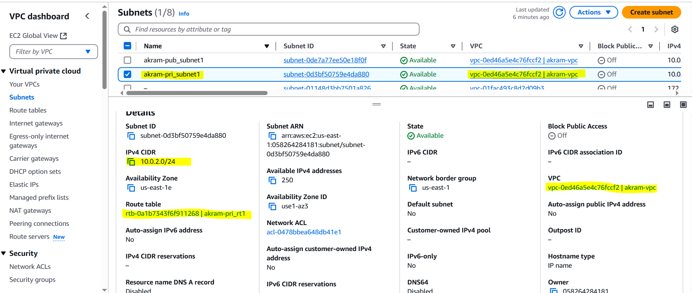

### 7️⃣ Public_Subnet_Association
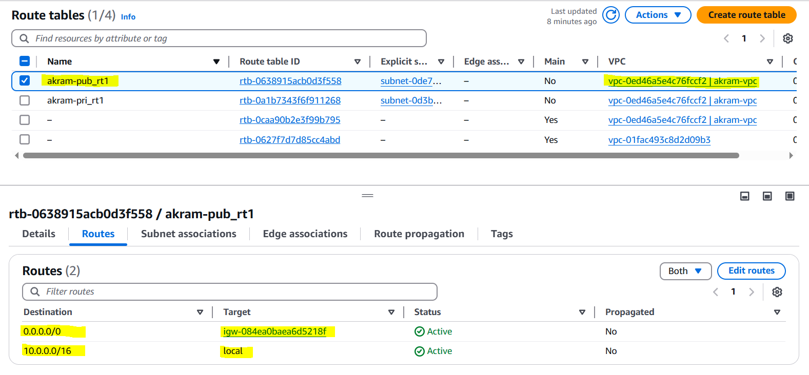

### 8️⃣ Private_Subnet_Association
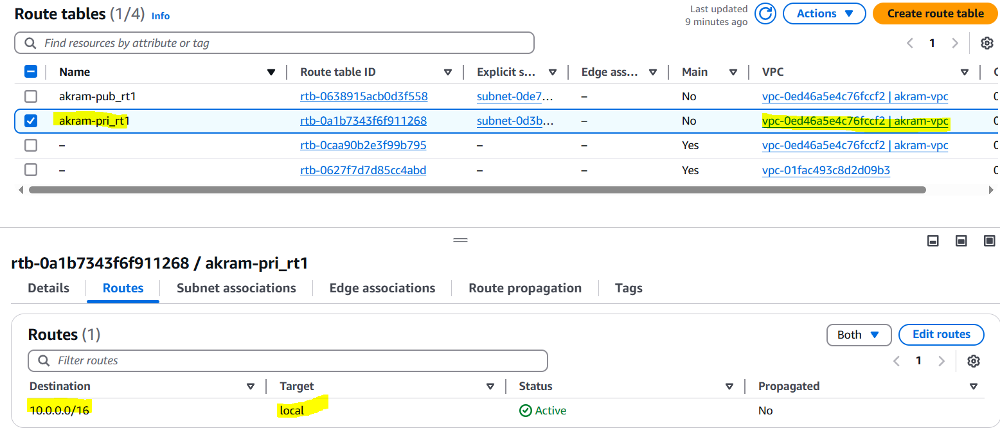

### 9️⃣ Security_Group
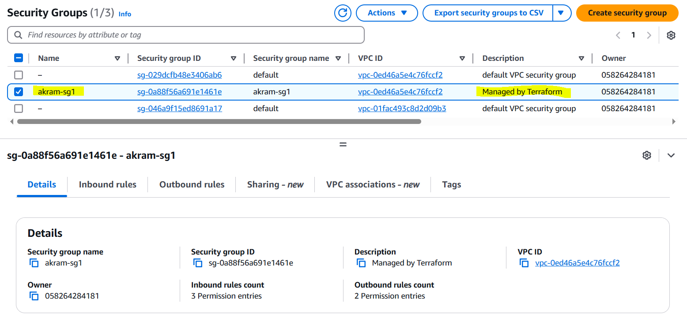

### 🔟 EC2-Web1
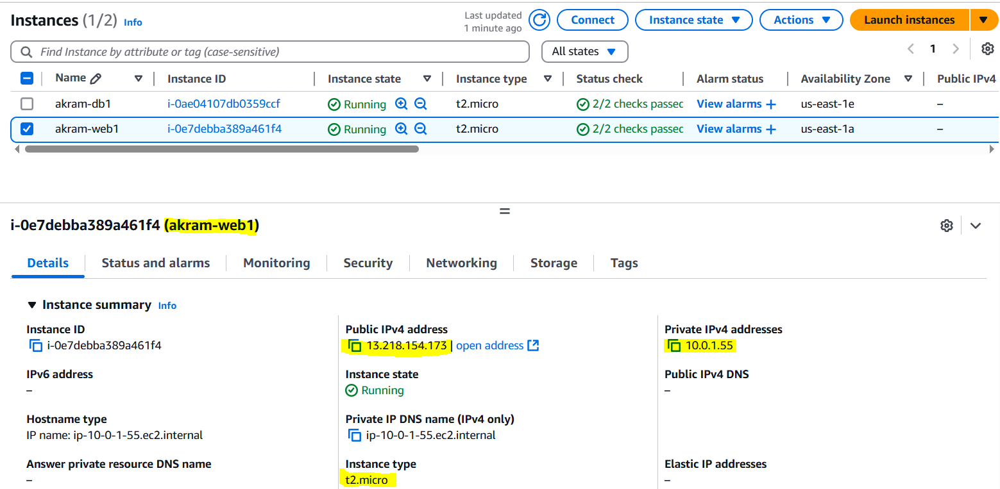

### 1️⃣1️⃣ EC2-DB1
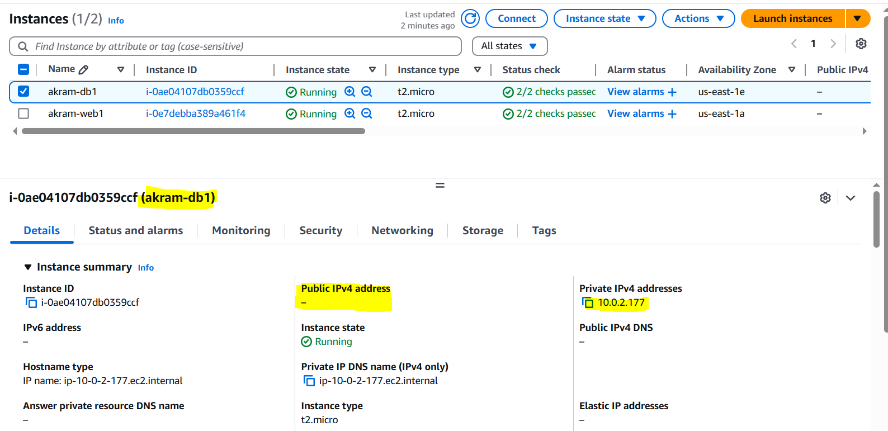

### 1️⃣2️⃣ Terraform_OutPuts
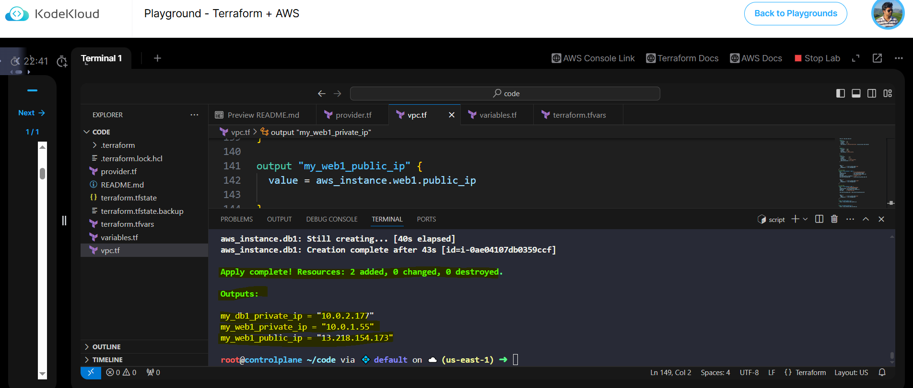

### 1️⃣3️⃣ Accessing-EC2-Web1
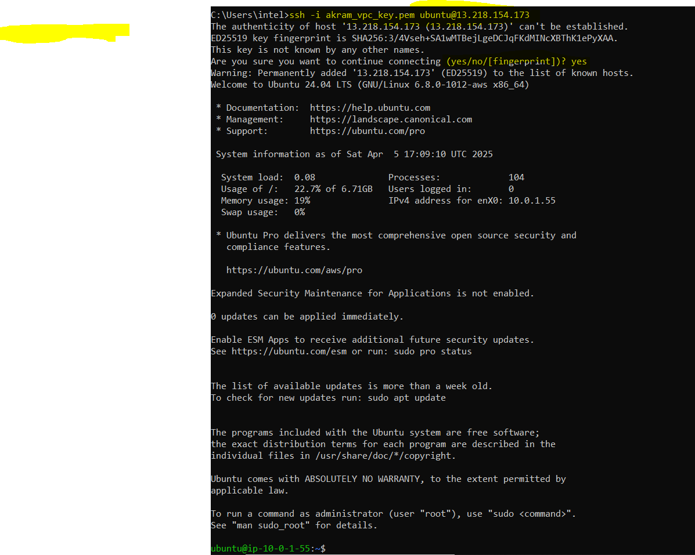

### 1️⃣4️⃣ Accessing-EC2-DB1-From WEB1
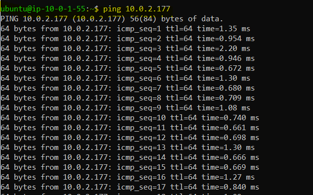
